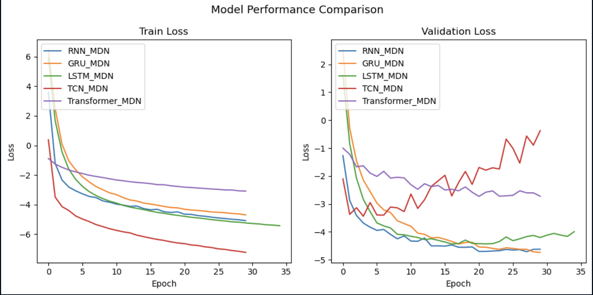

# From Cloudy to Clarity: Probabilistic Air Pollution Forecasting Using Mixture Density Networks

Capstone Team 3:
- Francis Mark Cayco
- Andgrel Heber Jison
- Angela Elaine Pelayo
- Eros Paul Estante

**Machine Learning 3**

Masters of Science in Data Science

Asian Institute of Management


## Abstract
Air pollution forecasting is inherently uncertain due to the complex, dynamic nature of environmental factors. Traditional point forecasting models fail to capture this uncertainty, often providing inaccurate or misleading predictions during extreme events. In this study, we propose a probabilistic forecasting framework based on Mixture Density Networks (MDNs) integrated with various sequential architectures, including RNN, GRU, LSTM, TCN, and Transformer models. Our results show that GRU-MDN achieves the best overall performance, with the lowest validation loss (–4.73) and strong generalization capabilities. In contrast, TCN-MDN, while achieving the lowest training loss, exhibits severe overfitting, and Transformer-MDN underperforms due to slower convergence and potential underfitting. We further demonstrate that the GRU-MDN model produces well-calibrated predictive distributions, with uncertainty intervals that effectively capture temporal variability in pollutants such as CO and NO. These results highlight the benefits of probabilistic modeling in environmental forecasting, enabling risk-aware decision-making and improved interpretability over deterministic approaches.

## Problem Statement
*How can Mixture Density Networks improve air pollution forecasting by providing uncertainty-aware predictions that support more informed and reliable business or policy decisions?*

Traditional air quality forecasting models frequently provide deterministic, single-point predictions without quantifying the associated uncertainty. This limitation can be problematic, especially when decision-making requires an understanding of the range of possible outcomes. Recent studies have highlighted this issue. For instance, research has shown that most current data-driven air quality forecasting solutions lack proper quantifications of model uncertainty, which is crucial for communicating the confidence in forecasts. This gap underscores the need for models that can provide probabilistic forecasts, offering a distribution of possible outcomes rather than a single deterministic prediction.

Incorporating uncertainty quantification into air quality forecasts allows for better risk assessment and more informed decision-making. Probabilistic models, such as those using deep learning techniques, have been developed to address this need, providing more reliable uncertainty estimates and improving the practical applicability of air quality forecasts.

## Purpose
The goal of this project is to develop a probabilistic air quality forecasting model that captures a full range of possible pollutant concentrations, rather than relying on single-point predictions.  Use Mixture Density Networks (MDNs) to model predictive uncertainty.


Train and evaluate the MDN framework using various sequence modeling architectures:
- LSTM-MDN
- GRU-MDN
- Classic RNN-MDN
- TCN-MDN
- Transformer-MDN


## Data Source
This project uses air quality index (AQI) data sourced from the OpenWeatherMap API, covering 138 cities globally from 2023 to 2025. For consistency and regional focus, we limit the scope to cities within Metro Manila, Philippines. The dataset contains hourly measurements of seven key air pollutants: sulfur dioxide (SO₂), nitrogen dioxide (NO₂), particulate matter (PM10 and PM2.5), ozone (O₃), and carbon monoxide (CO). These pollutants are commonly monitored in environmental health studies and serve as the prediction targets for our probabilistic forecasting models.

## Setting Up
If you wish to run this notebook:
1. Create and activate new conda environment with the following command:
```bash
conda env create -f environment.yml
```

## The Mixture Density Network (MDN) Framework
Traditional neural networks often predict a single outcome, which may not capture the inherent uncertainty in many real-world scenarios. MDNs address this by modeling the output as a mixture of multiple probability distributions, typically Gaussians, allowing the network to represent multiple plausible outcomes for a given input.
- Mixture of Gaussians: Instead of outputting a single prediction, MDNs output parameters for multiple Gaussian distributions (means, variances, and mixing coefficients), effectively modeling a probability distribution over possible outcomes.
- Handling Uncertainty: This approach is particularly useful in situations where the data is noisy or where multiple outcomes are possible, such as in time series forecasting or trajectory prediction.
- Training with NLL: MDNs are trained using the Negative Log-Likelihood (NLL) loss function, which encourages the model to assign high probabilities to the actual observed outcomes.


MDNs are well-suited for tasks that involve uncertainty and multiple possible outcomes, including:
- Time Series Forecasting: Predicting future values in a sequence where multiple future paths are possible.
- Trajectory Prediction: Estimating the future positions of moving objects, such as pedestrians or vehicles, where multiple paths may be plausible.
- Air Quality Forecasting: Modeling pollutant concentrations where various factors contribute to uncertainty in predictions.


This project implements a suite of sequence modeling architectures to support probabilistic air quality forecasting using Mixture Density Networks (MDNs). Each model outputs parameters of a Gaussian mixture (μ, σ, α) for each time step, allowing for uncertainty-aware predictions.

1. **LSTM-MDN**
- Combines Long Short-Term Memory (LSTM) layers with an MDN head.
- Well-suited for capturing long-range temporal dependencies.
- Recommended for stable training on sequential air quality data.

1. **GRU-MDN**
- Uses Gated Recurrent Units (GRUs), which are computationally lighter than LSTMs.
- Offers comparable performance with fewer parameters and faster training.

1. **RNN-MDN**
- A vanilla recurrent neural network with an MDN output layer.
- Serves as a baseline for evaluating improvements from gated or attention-based models.
- Prone to vanishing gradients in long sequences.

1. **TCN-MDN (Temporal Convolutional Network)**
- Uses causal 1D convolutions and dilations instead of recurrence.
- Captures long-term patterns with high parallelism.
- Tends to overfit without proper regularization (e.g., dropout, weight decay).

1. **Transformer-MDN**
- Utilizes self-attention to learn dependencies across the entire input sequence.
- Best suited for longer sequences or when attention-based modeling is beneficial.
- Requires careful tuning and more compute.

### Negative Log-Likelihood (NLL) Loss Function

Let:
- $ \mathbf{y} \in \mathbb{R}^D $ — target vector
- $ \boldsymbol{\mu}_k \in \mathbb{R}^D $ — mean vector of the $k$-th Gaussian
- $ \boldsymbol{\sigma}_k \in \mathbb{R}^D $ — standard deviation (scale) of the $k$-th Gaussian
- $ \alpha_k \in (0, 1) $ — mixture weight (prior probability) of the $k$-th Gaussian, where $ \sum_{k=1}^K \alpha_k = 1 $
- $ K $ — number of mixtures
- $ N $ — batch size

The mixture density network loss is the negative log-likelihood over a mixture of Gaussians:

$$ L_MDN = - (1 / N) * Σ_{i=1}^N log( Σ_{k=1}^K α_k^{(i)} * N(y^{(i)} | μ_k^{(i)}, σ_k^{(i)}) ) $$

Each Gaussian component with diagonal covariance is computed as:

$$ N(y | μ_k, σ_k) = Π_{d=1}^D [ 1 / sqrt(2πσ_{k,d}²) ] * exp( - (y_d - μ_{k,d})² / (2σ_{k,d}²) ) $$

Taking the logarithm of the Gaussian:

$$ log N(y | μ_k, σ_k) = - Σ_{d=1}^D [ (1/2) * log(2πσ_{k,d}²) + (y_d - μ_{k,d})² / (2σ_{k,d}²) ] $$ 

The final loss with log-sum-exp trick becomes:

$$ L_MDN = - (1 / N) * Σ_{i=1}^N log( Σ_{k=1}^K exp( log α_k^{(i)} + log N(y^{(i)} | μ_k^{(i)}, σ_k^{(i)}) ) ) $$ 


## Results



The training and validation loss curves in Figure X reveal key differences in how each model learns and generalizes over time. Both **GRU-MDN and RNN-MDN** demonstrate stable and effective convergence, with validation losses steadily decreasing and closely tracking their training losses—indicating strong generalization and minimal overfitting. In contrast, TCN-MDN exhibits the lowest training loss among all models, but this comes at the cost of a rapidly diverging validation loss after approximately 10 epochs. This behavior clearly signals severe overfitting, confirming the model’s inability to generalize beyond the training set. 

Meanwhile, Transformer-MDN shows signs of underfitting, characterized by slow loss reduction and early plateauing in both training and validation curves. This suggests that the model’s complexity may not be fully utilized given the dataset size or sequence length. 

Finally, LSTM-MDN performs competitively but shows slight fluctuations in validation loss in the later epochs, hinting at sensitivity to optimization dynamics or hyperparameter settings. Overall, GRU-MDN offers the most balanced performance in terms of convergence speed, generalization, and training stability.


Analysis of the forecast plots for CO and NO reveals that the model captures the temporal alignment of pollution peaks with high fidelity. However, the predicted expected values tend to underestimate the magnitude of extreme events, particularly visible in the CO forecast. Despite this, the model’s confidence intervals often enclose the ground truth, demonstrating that the MDN correctly conveys uncertainty through its probabilistic outputs.

Furthermore, the model adapts its uncertainty estimates to the volatility of the signal: intervals narrow during stable periods and widen during peaks or transitions, which aligns with the expected behavior of aleatoric uncertainty modeling.


The confidence intervals successfully cover the majority of the true values, especially during high-volatility periods, suggesting that the MDN’s variance estimates (σ) appropriately scale with data uncertainty. During relatively stable periods, the intervals tighten, indicating low predicted uncertainty, whereas during sharp peaks or transitions, the intervals expand, reflecting higher uncertainty in the model’s forecast.
## Conclusions

Among the five architectures evaluated, GRU-MDN achieved the best performance with the lowest validation loss of –4.73, indicating strong generalization capability. LSTM-MDN and RNN-MDN followed closely behind with similar training and validation losses, suggesting stable learning and good fit.

In contrast, TCN-MDN exhibited the lowest training loss (–7.23) but a dramatically higher validation loss (–0.38), indicating significant overfitting — the model memorized the training data but failed to generalize. Meanwhile, Transformer-MDN had the highest training time per epoch (~11s) but did not outperform simpler models, possibly due to overparameterization or insufficient sequence length for attention mechanisms to shine.

Overall, GRU-MDN offers the best trade-off between accuracy and training efficiency for this task. Further improvements could explore regularization techniques for TCN or architecture tuning for Transformer to mitigate underperformance and overfitting.


## Recommendations

Based on the results, several improvements can be made to both the modeling approach and the use of Mixture Density Networks (MDNs). Since GRU-MDN yielded the best validation performance, it would be beneficial to further explore deeper or wider GRU architectures, balancing model capacity with overfitting risk. The TCN-MDN model suffered from severe overfitting; introducing dropout layers, weight decay, or early stopping may help control this. The Transformer-MDN, while expressive, did not outperform simpler models and incurred the highest training time. It may benefit from architectural simplification, such as reducing the number of layers or attention heads, and from tuning positional encodings more suited to time series data.

For MDNs specifically, one recommendation is to clamp or regularize the predicted standard deviation \sigma to prevent the model from becoming overconfident and numerically unstable. This can be done using techniques like exponential transformations followed by a minimum clamp value. Another concern is mixture collapse, where one or two components dominate the mixture. This can be mitigated by softening the softmax temperature or adding a loss penalty that promotes component diversity. It is also important to perform visual diagnostics of the predicted distributions, particularly in scenarios where multi-modal predictions are expected — this highlights where MDNs are most valuable.

MDNs can serve as strong uncertainty-aware forecasting baselines and should be compared with other probabilistic modeling approaches suach as Deep Ensembles, Bayesian Neural Networks, Variational Autoencoders, and Quantile Regression.

## Declaration on the Use of Large Language Models (LLMs)

This notebook and its accompanying Python code were developed with the support of large language models (LLMs), particularly OpenAI’s ChatGPT, which assisted in several key areas:

Content Refinement:
- Enhanced the clarity and coherence of technical explanations.
- Suggested alternative phrasing and structural adjustments to improve readability.

Code Assistance:
- Provided guidance on algorithm selection and Python code implementation.
- Offered suggestions for debugging and code optimization.

While LLMs were used to augment productivity, all content and code were thoroughly reviewed, validated, and adjusted to ensure technical correctness, contextual relevance, and ethical integrity. The authors accept full responsibility for the final content, methods, and findings presented in this notebook.

